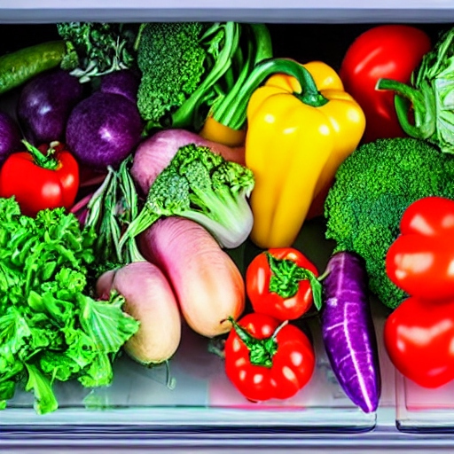

# CookGPT: Your AI-Based Chef

CookGPT is an innovative AI-based chef that combines the charm of traditional cooking with the efficiency of modern technology. Whether you're a culinary enthusiast, a busy professional, or someone looking for culinary inspiration, CookGPT is designed to make your cooking experience delightful, personalized, and effortless.

## Features

### 1. **Preserving Culinary Heritage**

CookGPT allows you to record the entire cooking process of your favorite dishes. With a simple click on your phone, the recorded video is converted into text and stored in the Language Model (LLM). This ensures the preservation of cherished family recipes for generations to come.

### 2. **Smart Grocery Shopping**


Walking into a grocery store becomes a breeze with CookGPT. The app, leveraging your location data, identifies the store and provides you with a list of various recipes you can cook based on the available grocery items. Simplify your shopping experience and discover new recipes based on fresh ingredients.

### 3. **Smart Fridge**


Click a photo of the contents inside your fridge, and CookGPT, considering your dietary preferences and nutritional needs, suggests various recipes. Reduce food waste by utilizing what's available and promote a healthier lifestyle with personalized recipes.

## Getting Started

Follow these steps to get started with CookGPT:

1. [Installation](#installation)
2. [Usage](#usage)
3. [Recording Recipes](#recording-recipes)
4. [Smart Grocery Shopping](#smart-grocery-shopping)
5. [Smart Fridge](#smart-fridge)

## Installation

Clone the repository to your local machine:

```bash
git clone https://github.com/your-username/CookGPT.git
cd CookGPT
